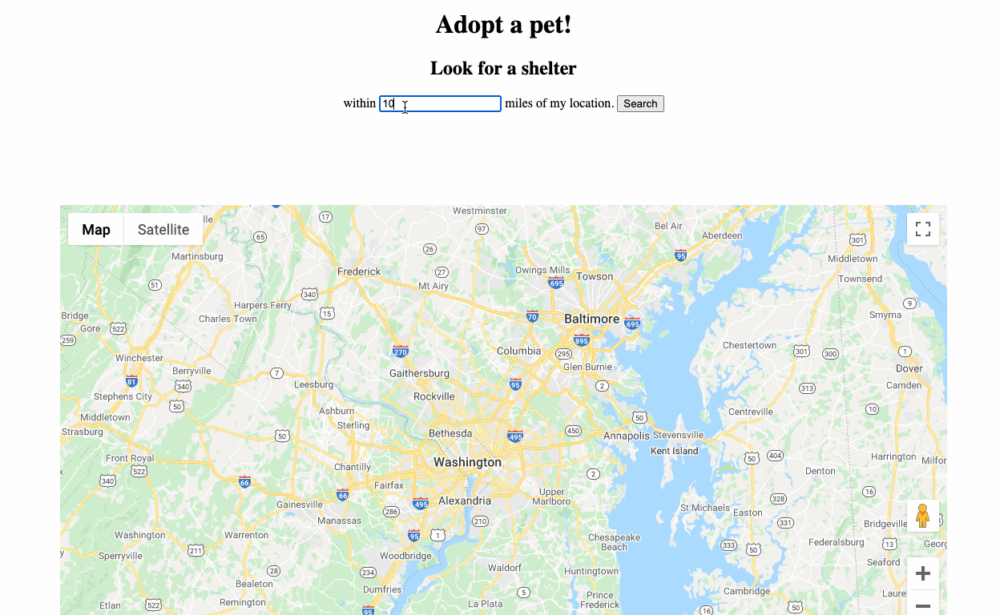

# Pet Finder Map Search

An app that renders map with shelters using distance search and user browser location. Pet data from the [petfinder API](https://www.petfinder.com/developers/v2/docs/), map data from the [Google Maps API](https://developers.google.com/maps/documentation).

Not deployed yet because of complications of the API key (will explain in the bottom), but it works like this:

A few notes if you are interested, and for my future self:

## Google Maps API
Google Maps APIs are a little complicated and the documentations are not always beginner-friendly. A lot of tutorials on Youtube are outdated. I recommend following tutorial series if you're also a beginner learning to use Google Maps API:

[2-part series by Coding With Leif](https://www.youtube.com/watch?v=C6VxJoR3754)

[4-part series by WittCode](https://www.youtube.com/watch?v=Ad7bS3g87ds&list=PLkqiWyX-_Lot4FvynFl9i0vY1PbS11mHR)

Okay here're a few things I learned:

### Geocoding API vs Geocoding Class in Maps JavaScript API
Yes, they are separate. The [Geocoding API](https://developers.google.com/maps/documentation/geocoding/start) deals with static known addresses and the [Geocoder class](https://developers.google.com/maps/documentation/javascript/geocoding) provided within the Maps JavaScript API geocode dynamically from user input. So in my case I need the latter.

### Accessing the Geocoding Class 
"You access the Google Maps API geocoding service within your code via the google.maps.Geocoder constructor object," the documentation says. 

If you're a beginner like me, it might not click immediately, so here's what it means in code:

    Geocoder = new google.maps.Geocoder();

Then you can pass in the location information in an object into the Geocoder.geocode() method like this:

    Geocoder.geocode(GeocoderRequest)

## About hiding the Google Maps API key
To be able to use the API, you'd have to have credit card info on file, so you don't want to hard code it as a variable and push it to Github. 

I tried storing it in dotenv file but it was impossible to access it as a variable in the JavaScript code because the way the Google API works is you reference the key in the front end, in a script tag in the html file like this:

    

So an engineer friend suggested that I store the key in an environment.js file, create a script element with the src attribute and append it to the document:

    const myScriptTag = document.createElement('script');
    myScriptTag.src = `https://maps.googleapis.com/maps/api/js?key=${GOOGLE_API_KEY}&callback=initGoogle`;
    myScriptTag.setAttribute("async", "");
    document.body.appendChild(myScriptTag);

## Passing in access tokens for API calls and refreshing them
The petfinder API requires you to pass in access tokens to make API calls. The example code is a curl request:

    curl -H "Authorization: Bearer {YOUR_ACCESS_TOKEN}" GET https://api.petfinder.com/v2/{CATEGORY}/{ACTION}?{parameter_1}={value_1}&{parameter_2}={value_2}

Translated into JavaScript, you pass in the token in the headers object in your fetch request (which is followed by .then etc etc):

    fetch(shelterEndpoint, {
        headers: {
            Accept: "application/json",
            Authorization: `Bearer ${accessToken}`,
        },
    }).then()...

And because the token expire every hour, here's how to refresh it in curl:

    curl -d "grant_type=client_credentials&client_id={CLIENT-ID}&client_secret={CLIENT-SECRET}" https://api.petfinder.com/v2/oauth2/token

To translate it in JavaScript, the -d is key. It means you're POSTing data instead of GETing, and the data is that long string. So you'd need to change the mothod to 'POST' in the fetch request, and pass in the body object as a string:

    const body = {
        "grant_type": "client_credentials",
        "client_id": YOUR_CLIENT_ID,
        "client_secret": YOUR_CLIENT_SECRET
    }

    fetch('https://api.petfinder.com/v2/oauth2/token', {
        method: 'POST',
        body: JSON.stringify(body),
        headers: {
            'Content-Type': 'application/json; charset=utf-8'
        }
    })
    .then(response => response.json())
    .then(auth => {
        // console.log(auth.access_token);
        return auth.access_token;
    })
    .catch(error => console.error(error))

BUT, this will only return a promise! You can console log auth.access_token okay but can't return it, weird right? You'd have to return the entire fetch request, and then access the value in .then(), like [this post](https://stackoverflow.com/questions/47604040/how-to-get-data-returned-from-fetch-promise) explains.

If you wrap it into a function it works like this:

    async function refreshToken() {
        const body = {
            "grant_type": "client_credentials",
            "client_id": YOUR_CLIENT_ID,
            "client_secret": YOUR_CLIENT_SECRET
        }
        return fetch('https://api.petfinder.com/v2/oauth2/token', {
            method: 'POST',
            body: JSON.stringify(body),
            headers: {
                'Content-Type': 'application/json; charset=utf-8'
            }
        })
        .then(response => response.json())
        .then(auth => {
            return auth.access_token;
        })
        .catch(error => console.error(error))

    }

    let accessToken;
    refreshToken().then((token) => {
        accessToken = token;
    }) 

## What's next

### Deployment

I'd love to have it deployed so that it can be tested by other people. I tried turning it into an express app and attempted deployment with Heroku, BUT even if I store the Google API key as an environment variable in Heroku setting, I can't access it in the front end. So if you have any ideas, let me know!

### Other features

Ideally I'd love for the popups of the markers to show information of available pets rather than just information of the shelters. 

### Refactoring code

Currently the map loads very slowly and my code is not the most efficient and modular-ized. I'd love to refactor it into an React app.

